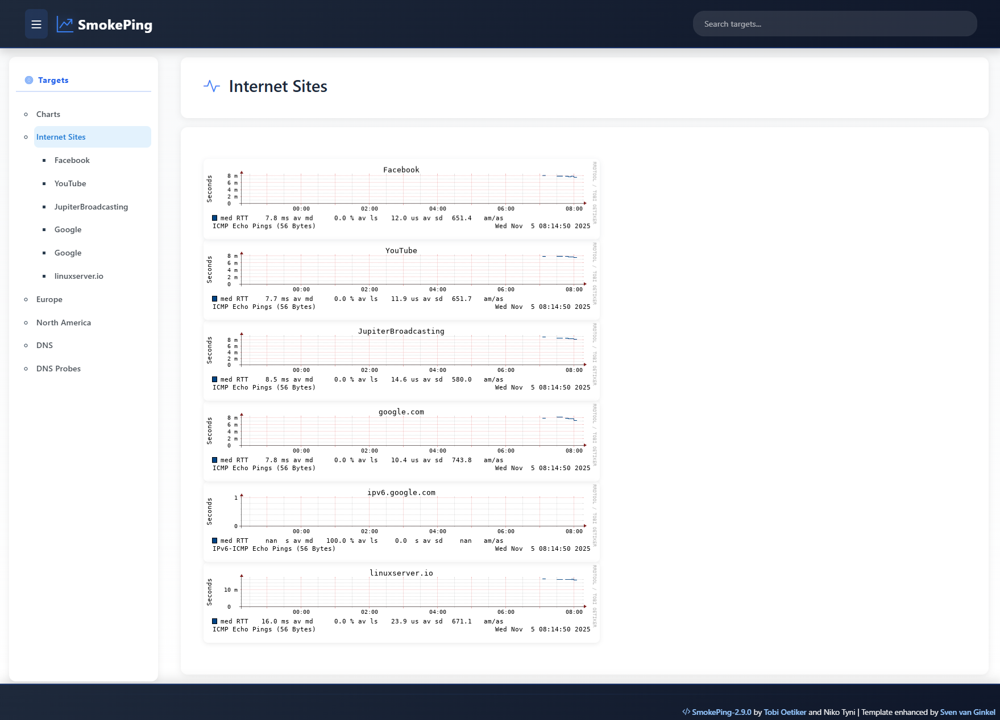

# SmokePing - Modern Bootstrap WebUI

A modern, responsive SmokePing web interface built with Bootstrap 5 and enhanced UX features.

## Features

- **Fully Responsive Design** - Works seamlessly on desktop, tablet, and mobile devices
- **Modern UI/UX** - Clean card-based design with smooth transitions and animations
- **Collapsible Sidebar** - Toggle navigation sidebar on both desktop and mobile
- **Interactive Charts** - Hover effects and zoom capability with crosshair cursor
- **Search Functionality** - Quick target search in the navbar
- **Dynamic Remark Display** - Context-aware remark blocks on homepage and target pages
- **Mobile-Optimized** - Hamburger menu, overlay navigation, and responsive layout
- **Smooth Animations** - Fade-in content, smooth scrolling, and transition effects
- **Custom Scrollbars** - Styled scrollbars for better aesthetics
- **Dark Gradient Theme** - Professional navbar and footer with gradient backgrounds

## Screenshots



## Installation

### Bare Metal

Replace the standard basepage.html:

```bash
cd /etc/smokeping
mv basepage.html basepage.html.bak
wget https://raw.githubusercontent.com/svenvg93/smokeping-bootstrap/refs/heads/main/basepage.html
```

### Docker

Use Docker volumes to mount the custom basepage into the container:

```yaml
volumes:
  - ./basepage.html:/etc/smokeping/basepage.html
  - ./config:/config
  - ./data:/data
```


## Configuration Tips

### Graph Background

Set `graphborders = no` at the top of the Presentation file for borderless graphs with white background:

```bash
graphborders = no
```

### Packet Loss Visualization

Enable packet loss as colored bars in charts by setting `loss_background = yes` in the detail section of the Presentation file:

```bash
loss_background = yes
```

### Custom Remarks

Add remarks to your targets in the Targets configuration file:

```
++ Facebook
menu = Facebook
title = Facebook
remark = facebook.com | AS1234
host = facebook.com
```

Remarks will display:
- On the homepage as a welcome block
- Under each target title on target pages

## Technical Details

### Built With

- **Bootstrap 5.3.2** - Modern responsive framework
- **Bootstrap Icons 1.11.2** - Icon set
- **CSS Custom Properties** - For easy theming and maintenance
- **Vanilla JavaScript** - No additional dependencies

### Browser Support

- Chrome/Edge (latest)
- Firefox (latest)
- Safari (latest)
- Mobile browsers (iOS Safari, Chrome Mobile)

## Customization

The template uses CSS custom properties (variables) for easy customization. Edit the `:root` section in basepage.html:

```css
:root {
  --primary-blue: #3b82f6;
  --navy-dark: #1e293b;
  --navbar-height: 85px;
  --border-radius: 12px;
  --transition-speed: 0.3s;
  /* ... more variables */
}
```

## Acknowledgements

- [tsumaru720/smokeping-bootstrap](https://github.com/tsumaru720/smokeping-bootstrap) - Original inspiration
- [oetiker/SmokePing](https://github.com/oetiker/SmokePing) - SmokePing project
- [linuxserver/docker-smokeping](https://github.com/linuxserver/docker-smokeping) - Docker image

## License

This project maintains compatibility with SmokePing's original licensing.

## Contributing

Contributions, issues, and feature requests are welcome! Feel free to check the issues page.
